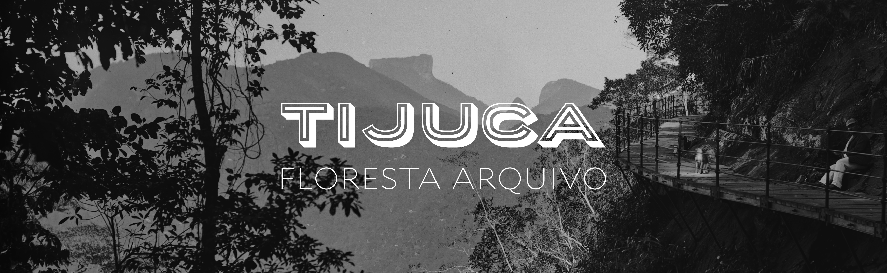

Olá! __Tiju.ca__ é um projeto de história pública sobre o __[Parque Nacional da Tijuca](https://pt.wikipedia.org/wiki/Parque_Nacional_da_Tijuca)__ (PNT), que reúne documentação sob a guarda de diversas instituições brasileiras e estrangeiras. Aqui disponibilizamos reproduções digitais de documentos físicos em vários suportes (incluindo telas, gravuras e fotografias), assim como transcrições, traduções, artigos e ensaios de pesquisadores dedicados ao tema.

Este é um ambiente de pesquisa feito para educadores, estudantes, turistas e moradores interessados na história do PNT. Nosso objetivo é divulgar e garantir a verificabilidade da pesquisa histórica, sempre respeitando os limites impostos pelas leis de direito autoral. A curadoria dos conteúdos é definida por um __[conselho editorial](team)__ e sugestões podem ser enviadas por __[email](mailton:buccalon@rice.edu)__.
